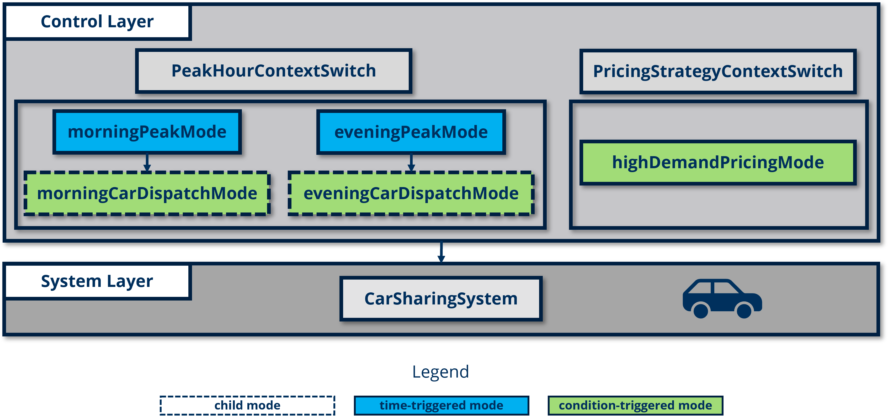

# CarSharingSystem

This case study demonstrates how the **ContextVariabilityManager** can be used to implement modular and maintainable control logic within a car-sharing system. The model enables dynamic control of car dispatch and pricing based on contextual factors such as peak hours and user demand. The **ContextVariabilityManager** library is leveraged to introduce time-based and condition-based context events, enhancing flexibility without modifying the core system model.

The structure of the case study is organized as follows:

```
CarSharingSystemCaseStudy      
├── CarSharingSystem                  
├── PeakHoursContextSwitch
├── PricingStrategyContextSwitch
└── CarSharingSystemCaseStudy
```

- **CarSharingSystem**: The base car-sharing system model, adapted with connectors to integrate control layers.
- **PeakHoursContextSwitch**: A control module to dispatch cars based on peak hours using time-based and condition-based context events.
- **PricingStrategyContextSwitch**: A control module to dynamically adjust pricing based on user demand.
- **CarSharingSystemCaseStudy**: The integration model that connects the control modules with the base car-sharing system.

As illustrated in the diagram below, this case study includes five contexts: three condition-based contexts and two time-based contexts. Two of the condition-based contexts are children contexts of the time-based contexts.



## Modules
### Module 1: CarSharingSystem

The **CarSharingSystem** model with 2824 variables and equations is based on an open-source car-sharing system repository, available [here](https://git-st.inf.tu-dresden.de/wang/pn4ecss). To integrate control logic, two input and output connectors are added for interfacing with the control layers, while other components remain unchanged.
```modelica
// Added connectors
  output Real currentNumUsers(start = numUsers) "Current number of users in the system";
  output Real currentNumCars(start = numCars) "Current number of available cars in the system";
  input Real carDispatch "Current number of dispatched cars into the system because of high usage";
  input Real currentPrice "Current price base on demand";

// Rest part of the model is unchanged...
```

### Module 2: PeakHoursContextSwitch

The **PeakHoursContextSwitch** module introduces both time-based and condition-based context events to control car dispatching during peak hours. The model activates different contexts based on defined morning and evening peak hours and adjusts car availability when the current number of cars falls below a threshold. 

Here are the four context definitions:

```modelica
ContextWithTimeEvent morningPeak(
    activationTimes = {morningPeakStartTime},
    deactivationTimes = {morningPeakEndTime})
    "Context for Morning Peak";

  ContextWithTimeEvent eveningPeak(
    activationTimes = {eveningPeakStartTime},
    deactivationTimes = {eveningPeakEndTime})
    "Context for Evening Peak";

  ContextWithConditionEvent morningCarDispatch(
    parentContext = "morningPeak",
    activationCondition = (currentNumCars < 2) and morningPeak.isActive)
    "Condition-based context to increase car availability during Morning Peak";

  ContextWithConditionEvent eveningCarDispatch(
    startTokens = 0,
    parentContext = "eveningPeak",
    activationCondition = (currentNumCars < 1) and eveningPeak.isActive)
    "Condition-based context to increase car availability during Evening Peak";
```

In this setup, during peak hours, if `currentNumCars` falls below a certain level, cars are dispatched to meet demand. The remaining implementation is shown below:

```modelica
within CarSharingSystemCaseStudy;

model PeakHoursContextSwitch
  import CFPNlib.Components.Composite.ContextWithTimeEvent;
  import CFPNlib.Components.Composite.ContextWithConditionEvent;
  
  input Real currentNumCars;

  // Context definition...
  ...(shown above)  
  
  // Output variable to dynamically adjust based on active context
  output Real carDispatch;

equation
  // Adjust the car dispatch based on the active peak context
  carDispatch = if morningCarDispatch.isActive then 2
                  elseif eveningCarDispatch.isActive then 1
                  else 0;

end PeakHoursContextSwitch;
```

### Module 3:  PricingStrategyContextSwitch

The **PricingStrategyContextSwitch** module uses a condition-based context event to dynamically adjust pricing based on user demand. When user numbers exceed a defined threshold, the system switches to a higher pricing strategy.

Example of the high-demand pricing context:

```modelica
// Pricing Contexts
  ContextWithConditionEvent highDemandPricing(
    activationCondition = currentNumUsers > highDemandThreshold
  ) "Context for High Demand Pricing";
```

The complete model adjusts pricing based on the active context, as shown below:

```modelica
within CarSharingSystemCaseStudy;

model PricingStrategyContextSwitch
  import CFPNlib.Components.Composite.ContextWithConditionEvent;
  
  input Real currentNumUsers;

  // Parameters defining the demand thresholds for switching pricing strategies
  parameter Integer highDemandThreshold = 8 "Threshold for High Demand Pricing (number of users)";

  // Parameters for pricing in different contexts
  parameter Real highDemandPrice = 20.0 "Price during high demand (per unit)";
  parameter Real normalDemandPrice = 10.0 "Price during low demand (per unit)";
  
  // Context definition...
  ...(shown above)

  // Output to indicate the current pricing based on demand
  output Real currentPrice;

equation
  // Adjust the price based on the active pricing context
  currentPrice = if highDemandPricing.isActive then highDemandPrice 
                 else normalDemandPrice;

end PricingStrategyContextSwitch;
```

### Module 4: CarSharingSystemCaseStudy

This integration model combines the **CarSharingSystem** model with the **PeakHoursContextSwitch** and **PricingStrategyContextSwitch** control modules. By connecting these modules, the car-sharing system can respond dynamically to peak hour demands and adjust pricing based on user demand without modifying the original system model.

```modelica
within CarSharingSystemCaseStudy;

model CarSharingSystemCaseStudy
  import CarSharingSystem;
  import PeakHoursContextSwitch;
  import PricingStrategyContextSwitch;

  // Instantiate components for the car sharing system and context switches
  CarSharingSystem carSharingSystem;
  PeakHoursContextSwitch peakHoursContextSwitch;
  PricingStrategyContextSwitch pricingStrategyContextSwitch;
  
equation
  // Pass the current number of cars to the PeakHoursContextSwitch
  peakHoursContextSwitch.currentNumCars = carSharingSystem.currentNumCars;
  
  // Pass the current number of users to the PricingStrategyContextSwitch
  pricingStrategyContextSwitch.currentNumUsers = carSharingSystem.currentNumUsers;
  
  // Pass the output from PeakHoursContextSwitch to CarSharingSystem
  carSharingSystem.carDispatch = peakHoursContextSwitch.carDispatch;
  
  // Pass the current price from PricingStrategyContextSwitch to CarSharingSystem
  carSharingSystem.currentPrice = pricingStrategyContextSwitch.currentPrice;

end CarSharingSystemCaseStudy;
```
