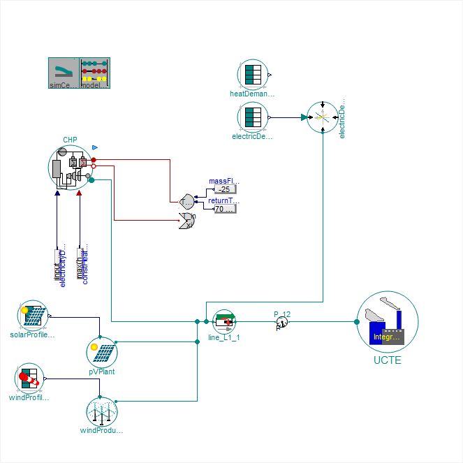
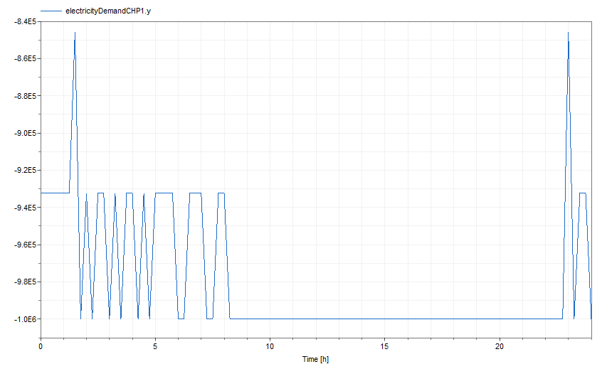
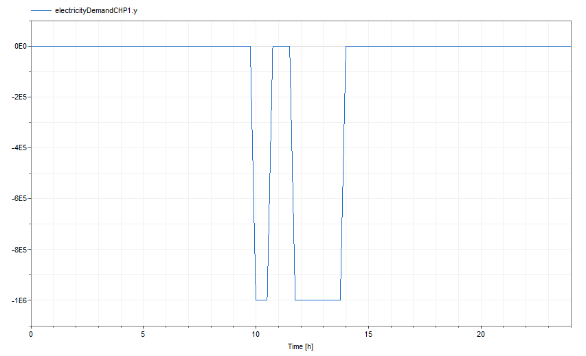

# ElectricGrid

The [TransiEnt]([GitHub - TransiEnt-official/transient-lib: official and current version of TransiEnt library](https://github.com/TransiEnt-official/transient-lib)) library is an award-winning, open-source Modelica library designed for modeling complex energy systems. This case study demonstrates how **CFPNlib** can be easily integrated to add control logic on these sophisticated models. The model consists of 1992 equations and variables, reflecting its complexity and realism in simulating the operation of a real-world grid.

The model represent a simulation of an electrical grid system, incorporating renewable energy sources such as **solar panels** (bottom left), **wind plants** (bottom left), and a **Combined Heat and Power (CHP) plant** (left) into an **electric grid** (bottom right) that serves **user demands** (top right). The system is designed to balance power production from various sources with the dynamic energy demand from consumers. 



This case study specifically showcases how to seamlessly integrate control logic into an existing energy system model. As an example, we demonstrate the implementation of a **renewable energy priority mode**. This mode prioritizes renewable energy sources by shutting down the CHP plant and relying solely on solar and wind power when certain conditions are met. These conditions ensure that the grid operates efficiently and sustainably, leveraging renewable resources when available.

## Control Logic

In this case study, a **renewable energy priority mode** was added to the original electrical grid model. This control logic ensures that the Combined Heat and Power (CHP) plant only operates when renewable energy sources (solar and wind) are insufficient to meet the energy demand. The logic is implemented as follows:

```modelica
model ElectricGridCaseStudy
  // Base model: TransiEnt.Examples.Electric.ElectricGrid_StandAlone

  // Importing necessary component for context-based conditional event handling
  import CFPNlib.Components.Composite.ContextWithConditionEvent;
  
  (original code)
  
  // Variables
  Real currentDemand;
  Real currentPVPower;
  Real currentWindPower;
  Real input_value;

  // Context-based event for Renewable Priority Mode
  ContextWithConditionEvent renewablePriorityMode(
    contextName = "RenewablePriorityMode",
    startTokens = 0,
    activationCondition = (currentDemand < 1e6 and currentPVPower > 500 and currentWindPower > 5e5));
    
equation
	(original code)
	
	// Equations to assign real values based on the current power consumption and production
  currentDemand = electricDemand.epp.P;
  currentPVPower = abs(pVPlant.epp.P);
  currentWindPower = abs(windProduction.epp.P);

  // Conditional assignment based on the status of renewablePriorityMode
  when renewablePriorityMode.isActive then
    input_value = -min(electricDemandTable.y1 + 0.5e6, 1e6);
  elsewhen not renewablePriorityMode.isActive then
    input_value = 0;
  end when;
  
end ElectricGridCaseStudy;
```

This logic enables dynamic control of the CHP plant based on real-time conditions, improving the efficiency and sustainability of the grid by prioritizing renewable energy sources.

## Results

### Original Operation of the CHP Plant

Before integrating the control logic, the CHP plant operated continuously to meet the energy demand. This often led to unnecessary use of the CHP plant when renewable energy sources were available. Below is the diagram showing the original operation:



### Operation After Adding Control Logic
Once the renewable energy priority mode is activated, the CHP plant is switched off when renewable energy production is sufficient to meet the demand. This is triggered by the conditions set in the control logic, such as low demand and high solar and wind energy production. Below is the diagram illustrating the operation with the new control logic in place:



The results show that the CHP plant is only used when necessary, optimizing the grid's reliance on renewable energy and reducing the operational cost and environmental impact of fossil fuel-based energy generation.

## Summary

This case study demonstrates how to integrate a simple yet effective control logic into an existing energy system model using the **CFPNlib** library. By adding the renewable energy priority mode, we are able to ensure that the grid prioritizes renewable energy sources like solar and wind, and only uses the CHP plant when required by the energy demand.

The integration of this control logic is straightforward, requiring minimal changes to the existing model. By using the intuitive **CFPNlib** components, we can easily define the conditions for switching the CHP plant on or off based on real-time energy generation and demand, without the need for complex modifications to the original system structure.

The model with integrated control logic is more dynamic and adaptable to changing conditions in the energy environment, making it a valuable tool for optimizing real-world electrical grids. This approach highlights the flexibility and simplicity of using **CFPNlib** to add intelligent control to complex models, enabling more efficient and sustainable energy system management.