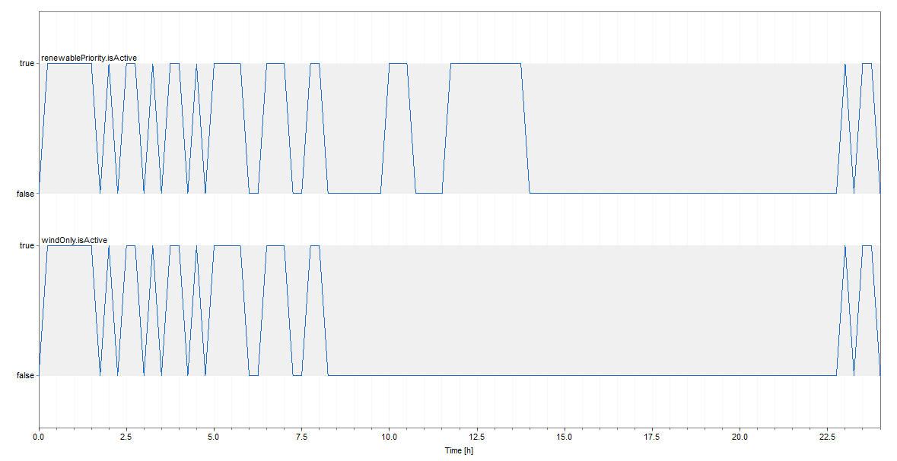

# ElectricGrid

The [TransiEnt]([GitHub - TransiEnt-official/transient-lib: official and current version of TransiEnt library](https://github.com/TransiEnt-official/transient-lib)) library is an award-winning, open-source Modelica library designed for modeling complex energy systems. 

This case study specifically showcases how to seamlessly integrate control logic into an existing energy system model. This model consists of 1992 variables and equations, reflecting its complexity and realism in simulating the operation of a real-world grid.

This model represent a simulation of an electrical grid system, incorporating renewable energy sources such as **solar panels** (bottom left), **wind plants** (bottom left), and a **Combined Heat and Power (CHP) plant** (left) into an **electric grid** (bottom right) that serves **user demands** (top right). The system is designed to balance power production from various sources with the dynamic energy demand from consumers. 


## Control Logic

In this case study, a `renewablePriority` context and a `windOnly` context were added to the original electrical grid model. Both contexts are condition-based and are weakly included.

When the `renewablePriority` context is active, the Combined Heat and Power (CHP) plant stops operating. When the `windOnly` context is active, only wind energy is used. Since the `windOnly` context is weakly included within the `renewablePriority` context, the CHP plant also stops operating when the `windOnly` context is active.

The logic is implemented as follows:

```modelica
model ElectricGridCaseStudy
  // Base model: TransiEnt.Examples.Electric.ElectricGrid_StandAlone

  // Importing necessary component for context-based conditional event handling
  import CFPNlib.Components.Composite.ContextWithConditionEvent;
  
  (original code)
  
  // Variables
  Real currentDemand;
  Real currentPVPower;
  Real currentWindPower;
  Real input_value;
  Real PV_output;

  // Context-based event for Renewable Priority Operation
  ContextWithConditionEvent renewablePriority(
    weakInclusionContext = "windOnly",
    activationCondition = (currentDemand < 1e6 and currentPVPower > 500 and currentWindPower > 5e5) or windOnly.isActive);

  // Context-based event for Wind Only Operation
  ContextWithConditionEvent windOnly(
    activationCondition = (currentDemand < 5e5));
    
equation
	(original code)
	
  // Equations to assign real values based on the current power consumption and production
  currentDemand = electricDemand.epp.P;
  currentPVPower = abs(pVPlant.epp.P);
  currentWindPower = abs(windProduction.epp.P);

  // Conditional assignment based on the status of renewablePriority
  CHP_input = if renewablePriority.isActive then 0 else -min(electricDemandTable.y1 + 0.5e6, 1e6);

  // Conditional assignment based on the status of windOnly
  PV_output = if windOnly.isActive then 0 else currentPVPower;
  
end ElectricGridCaseStudy;
```

As the results indicate, activating or deactivating the `windOnly` context also activates or deactivates the `renewablePriority` context.

