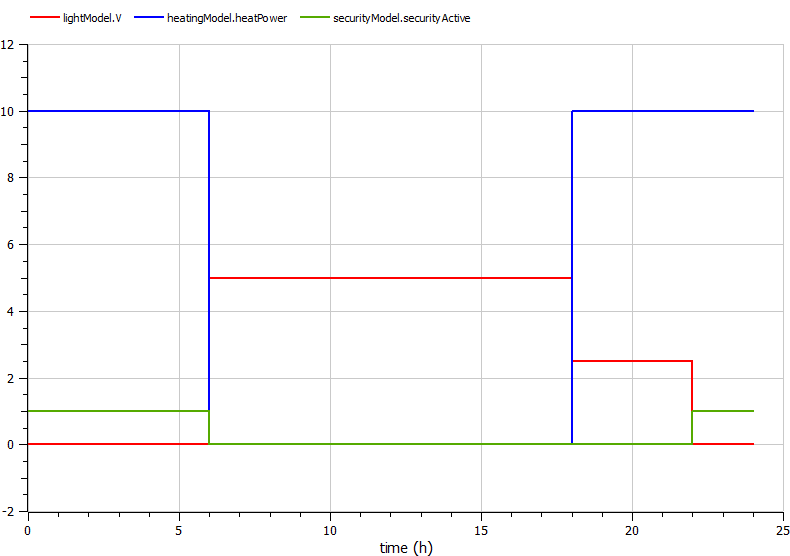
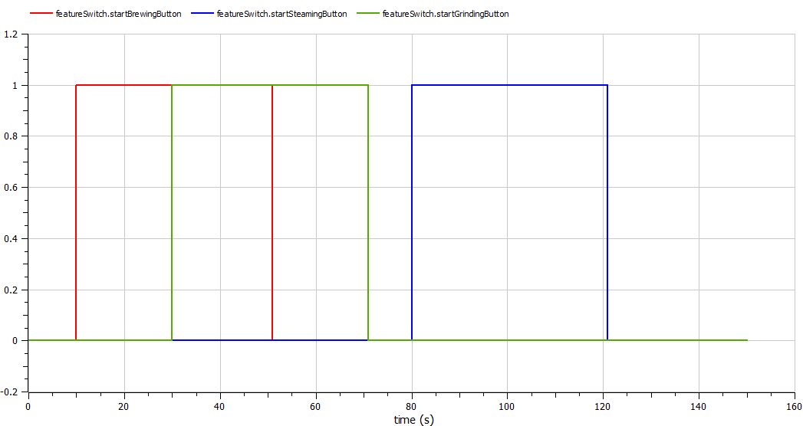
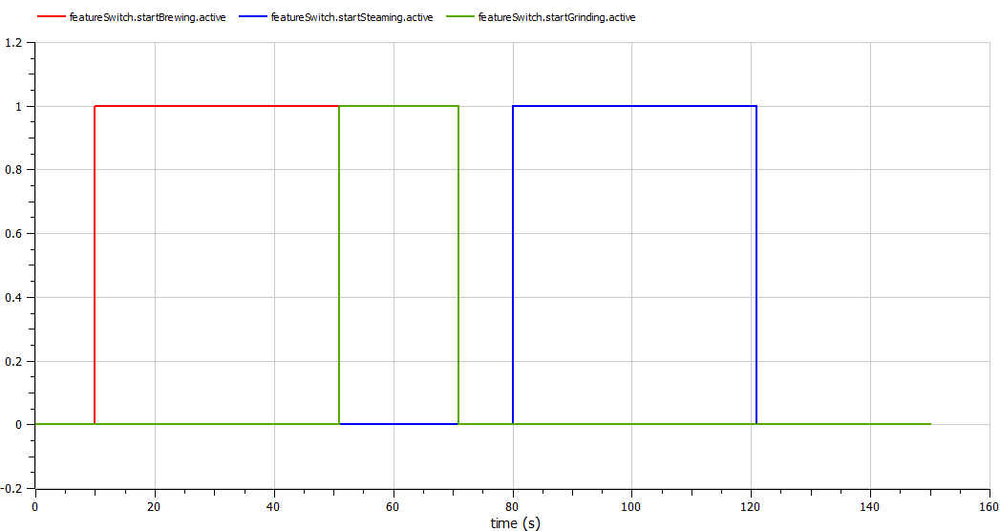
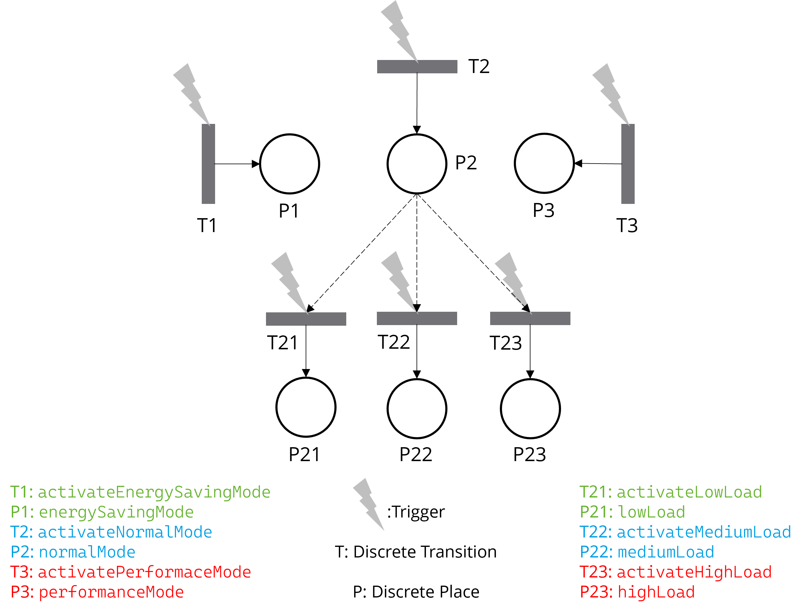
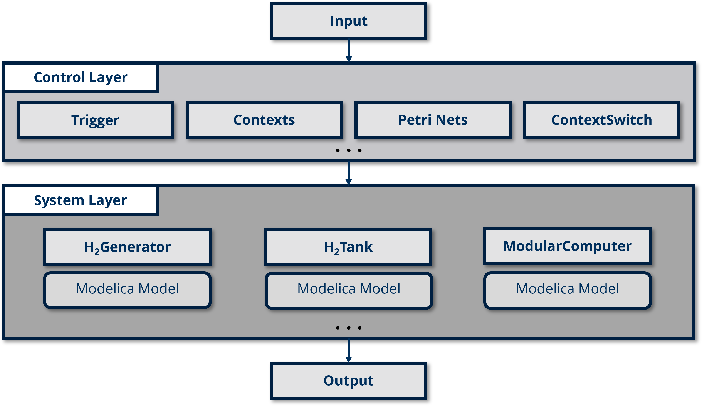
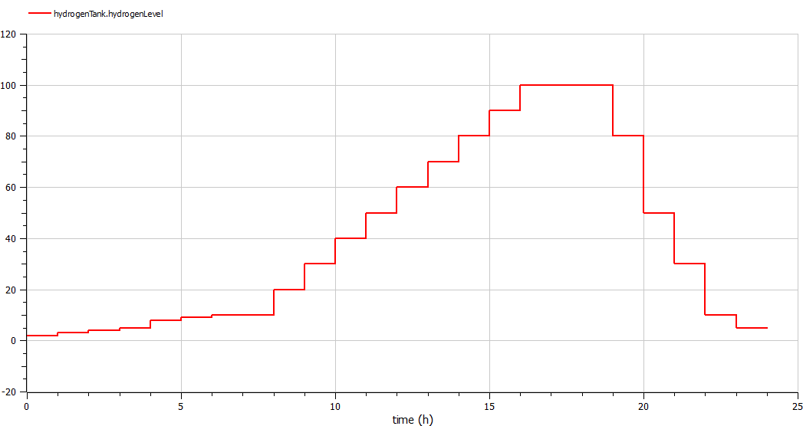
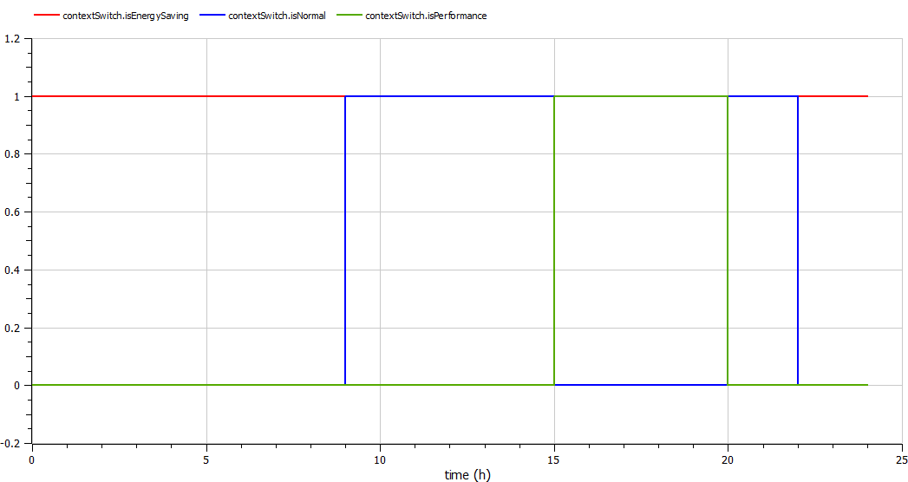
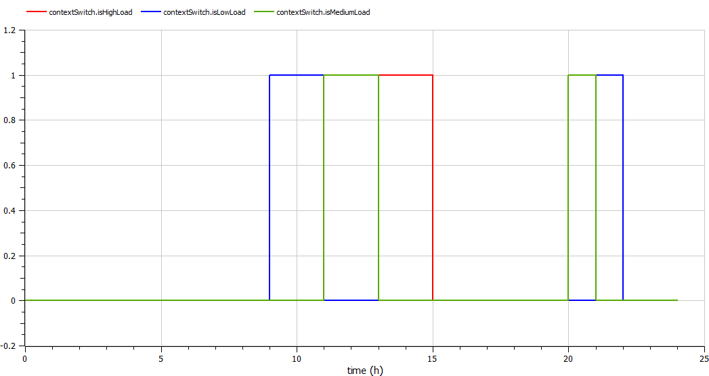

# Examples

## Example 1: SmartHome

In this example, the **light**, **heating**, and **security** modules in a smart home operate differently based on the active **context**: "day," "evening," or "night."

### Components

- **LightModel**: Adjusts lighting based on the time of day.
- **HeatingModel**: Turns on the heating system in "evening" or "night" mode.
- **SecurityModel**: Activates the security system during "night" mode.
- **ContextSwitch**: Manages context-switching logic based on the time of day.
- **SmartHome**: The main integration model for the SmartHome system.

### Result

Light, heating, and security—respond dynamically to the three modes (contexts): "day," "evening," and "night".

## Example 2: CoffeeMaker

This example simulates a coffee maker with three main functions—brewing, grinding, and steaming—each operating as distinct **features** within the system.

### Components

- **UserAction**: Simulates user inputs (button presses) that activate each feature for specific time durations.
- **FeatureSwitch**: Uses feature-based transitions to ensure each feature runs independently, avoiding conflicts. For example, grinding and steaming cannot run simultaneously due to exclusive activation.
  - **Feature 1**: Brewing
  - **Feature 2**: Grinding
  - **Feature 3**: Steaming
- **CoffeeMaker**: The main integration model that brings together the components to simulate a functioning coffee maker with independent and exclusive feature management.

### Result

When the button for the corresponding function (feature) is pressed, the process starts. The system also handles conflicts, for example, if the brewing process is ongoing and the button for steaming is pressed, the system will wait until the brewing process finishes before starting the steaming process.

## Example 3: GreenIT

This example models an energy-efficient system that manages power generation and usage based on hydrogen levels. It dynamically switches between different contexts to optimize energy use for a modular computer system.

### Components

- **HydrogenGenerator**: Produces hydrogen based on pre-defined production rates.

- **HydrogenTank**: Stores the generated hydrogen and monitors the current hydrogen level available for usage.

- **ModularComputer**: Consumes hydrogen-based electricity based on different operational modes (energy-saving, normal, and performance) and adjusts power consumption according to hydrogen availability.

- **ContextSwitch**: Manages context switching for the system based on hydrogen levels:
  - **Energy-Saving Mode**: Activated when hydrogen levels are low, minimizing power consumption.
  - **Normal Mode**: Enabled when hydrogen levels are moderate.
    - **Nested Load Levels**: (Low, Medium, High) adjust power usage within the performance mode.
  - **Performance Mode**: Engaged when hydrogen levels are high, allowing for maximum power consumption.
  
- **GreenIT**: The main integration model that coordinates all components, simulating an energy-efficient IT system.

### Result

Based on the available hydrogen level, the IT system adapts itself to different operational modes (energySavingMode, normalMode, and performanceMode). Within normalMode, the system further adapts to different load scenarios (LowLoad, MediumLoad, HighLoad).

