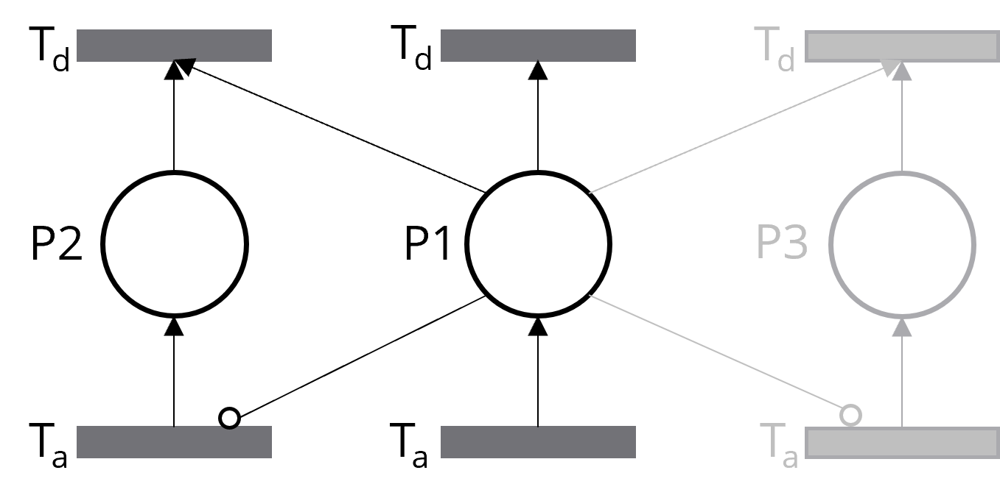

# V. FAQ

If you're interested, I have some valuable insights to share with you.

## 1. What Is The Difference Between Context and Feature?

In systems modeling, **contexts** define the broader state or environment in which a system operates, governing its behavior at any given moment. They are dynamic and can change in response to specific conditions, influencing the activation of other components. **Features**, on the other hand, are specific properties or functions of a system that vary within a context, like specific tasks or capabilities.

In Modelica, **contexts** are more commonly used to represent dynamic system states, while **features** can be applied for discrete functions, like a `brewing` or grinding operation in a `CoffeeMachine`, where physical equations aren't necessary.

In summary, **contexts** shape the system’s environment and behavior, while **features** define its capabilities within that environment.

## 2. How Does the Internal Logic Work?

In the base component, each context or feature is represented by a *place* with *activation* and *deactivation transitions*. The token count of the place is either 0 or 1—0 means the context is inactive, and 1 means it's active.

Here’s where it gets tricky. In Modelica, for a time-based context like `when t > 4`, the activation happens at `t = 4` and only triggers once. But for condition-based contexts like `when hydrogenLevel > 20`, activation keeps triggering as long as the condition holds. This constant triggering can hurt performance, and it also means the token count doesn’t toggle between 0 and 1—it just keeps increasing.

To solve this, I modified the Petri Net logic in the base component so the token count always stays 0 or 1. Whether it’s a time-based or condition-based trigger, the context is active when the token count is 1 and inactive when it’s 0. Simple and consistent!

## 3. Why Not Use Inhibitor Arcs?

Great question! I did consider inhibitor arcs but ran into two major issues.

1. **Dynamic Connections in Modelica**: To handle mutual exclusivity with inhibitor arcs, each component would need to dynamically create connections. For example, if `Context 1` and `Context 2` are mutually exclusive, and `Context 1` has priority, the place for `Context 1` would need to connect to the activation and deactivation transitions of `Context 2`. Now, imagine you have three, five, or even ten contexts, all with varying priorities and mutual exclusions—how could the base component dynamically adapt itself? Unfortunately, Modelica doesn’t support dynamically adding connectors like this, which makes scaling this approach impractical.

2. **Loss of Encapsulation**: If modelers had to manually connect these inhibitor arcs, the Petri Net mechanics wouldn’t stay hidden. That defeats the purpose of ContextVariabilityManager. My goal is to provide a modular, easy-to-use tool where modelers don’t need to understand the underlying Petri Net logic.

Instead, I came up with a more intuitive way to handle mutual exclusivity while keeping the flexibility. As shown in the `Grinding` and `Brewing` example, users can define priorities and exclusivity easily, without needing to dive into Petri Net details.

