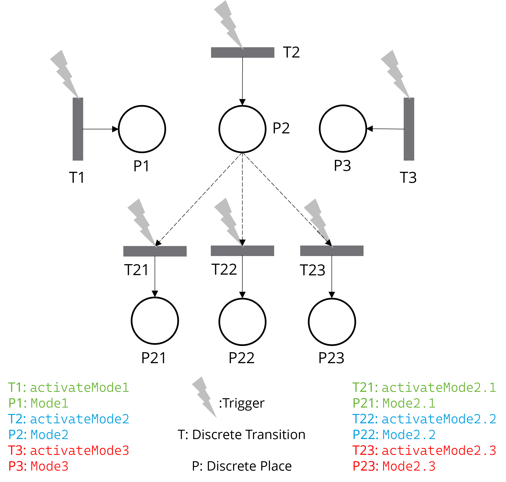

# CFPNlib

Enabling **Context-oriented Programming** and **variability management** in Modelica with **CFPNlib**: The Context Feature Petri Nets Library.

## Introduction

The CFPNlib is used to construct the **Control Layer** that manages variability, dynamically configuring the Modelica modules in the **System Layer** based on predefined rules and conditions. This layered approach provides a clear separation between **control logic** (CFPNlib modules) and **system dynamics** (Modelica models), enabling efficient management of complex systems with variable configurations.



Diagram 1: The CFPNlib-based control logic to manage dynamic mode switching in the system.


Diagram 2: A layered architecture where the CFPNlib Control Layer dynamically configures Modelica models in the System Layer.

## Structure:

```
CFPNlib
|-- Components
	|-- CFPNCore
		|-- DiscretePlace
		|-- TimeEventTransition
		|-- ConditionEventTransition
		|-- InhibitorArc
	|-- ContextPN
		|-- ContextPlace
		|-- ContextPlaceNested
		|-- ContextTransitionTimeEvent
		|-- ContextTransitionConditionEvent
	|-- FeaturePN
		|-- FeaturePlace
		|-- FeaturePlaceNested
		|-- FeatureTransitionTimeEvent
		|-- FeatureTransitionConditionEvent
|-- Examples
	|-- SmartHome 
		(Example using ContextPlace and ContextTransitionTimeEvent for context management)
	|-- CoffeeMaker 
		(Example using FeaturePlace and FeatureTransitionConditionEvent for feature management)
	|-- GreenIT 
		(Example using ContextPlaceNested and ContextTransitionConditionEvent for hierarchical context management)
```

## Functionality

1. **Variability Management**: Enables flexible management of system variability through **Contexts** and **Features**, allowing distinct behaviors or states based on conditions or triggers.

2. **Priority Handling**: Supports **priority-based transitions**, ensuring that higher-priority actions are executed first, especially useful for resolving conflicts or critical operations.

3. **Nested Contexts and Features**: Allows **hierarchical management** with **nested contexts and features**, enabling fine-grained control over complex, multi-level systems.

4. **Conflict Resolution**: Provides **conflict-handling mechanisms**, including **Inhibitor Arcs**, to enforce mutual exclusivity and prevent undesired simultaneous actions within system states or features.

5. **Separation of Concerns**: Promotes **better modularization** and **readability** for complex models, making it easier to manage, expand, and understand large systems with distinct functional areas or operational modes.