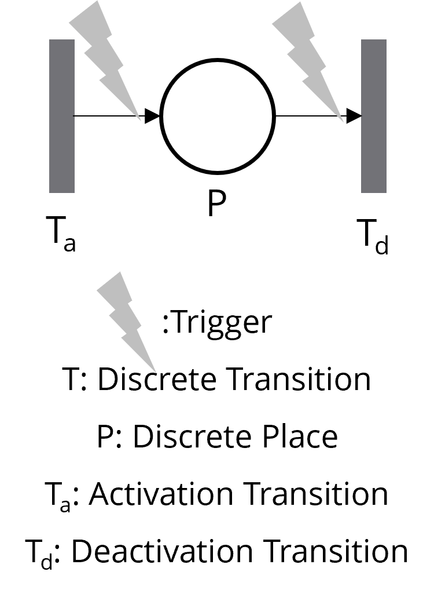
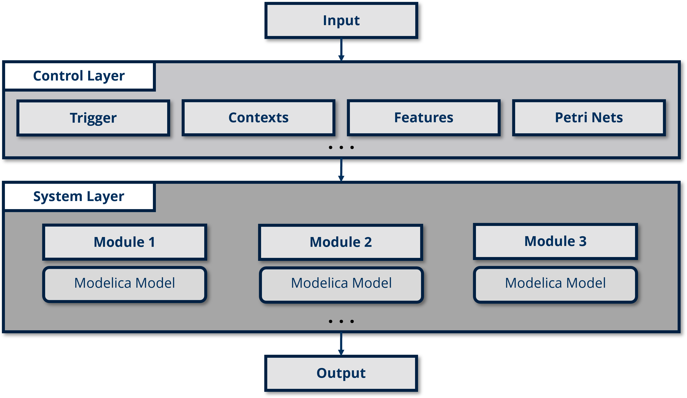

# CFPNlib

A powerful, context-driven Modelica library for adaptive, modular systems. CFPNlib simplifies variability management with intuitive tools for complex control logic.

## Introduction

In complex, adaptive systems, it is essential for components to respond dynamically to changes in context—whether those contexts are time-based (like day and night cycles) or resource-driven (like energy availability). However, most modeling languages, including Modelica, lack robust support for **Context-oriented Programming (COP)**, a paradigm that excels at modular, flexible, and adaptable system behavior. COP enables software and models to respond dynamically to various contexts without embedding complex logic within each individual component.

The benefits of COP include:

1.  Separation of Concerns
   * COP enables a clean separation between the core logic of each component and the contextual adaptations.
2. Modularity and Reusability
   * Each component can be reused in different contexts or applications without modification, making it highly adaptable to new requirements.
3. Easier Mantenance and Scalability
   * By isolating context-specific logic, COP makes it easier to maintain and extend the system. New contexts or conditions can be added with minimal changes to existing components.
4. Improved Readability and Understandability
   * COP improves the overall readability and structure of the codebase, as context-based variations are centralized and clearly defined.

Despite these advantages, COP is not natively supported in most modeling languages. **This is where CFPNlib comes in.**

## Why CFPNlib?

In Modelica, adapting a system to different operational contexts often involves embedding complex logic directly in each model. As the number of contexts grows, this approach can become difficult to maintain and expand. CFPNlib addresses this challenge by:

- Providing a library of **Context Feature Petri Nets** that act as context switches or mode managers.
- Allowing modelers to define context-specific configurations outside the core models.
- Dynamically controlling model behavior based on contexts (such as energy-saving or performance modes) without altering the core Modelica components themselves.

In CFPNlib, the base component (illustrated below) encapsulates each context/feature as a "place" with corresponding activation and deactivation transitions. **CFPNlib abstracts away the underlying Petri Net mechanics**, allowing modelers to intuitively define contexts, conditions for activation, parent-child context relationships, and mutual exclusivity, without needing expertise in Petri Nets. This design reduces complexity significantly.



Below is a straightforward example of defining mutually exclusive features, **"brewing"** and **"grinding"**, with "brewing" given priority. This setup ensures that if "brewing" is active, "grinding" cannot be activated, and if "grinding" is already active, it will be deactivated if "brewing" becomes active.

```modelica
  // Define Grinding Feature as a non-priority exclusive element
  FeatureWithConditionEvent grinding(
    featureName = "Grinding",
    activationCondition = startGrindingButton and (not brewing.isActive)  // Grinding can only be activated if Brewing is not active
  ) "Grinding feature";
```

Below is an example of hierarchical contexts, "LowLoad" is defined as a child context of "NormalMode", meaning that "LowLoad" can only activate if "NormalMode" is already active. This parent-child relationship simplifies managing multiple layers of conditions.

```modelica
  // Nested Load Levels within Normal Mode
  ContextWithConditionEvent lowLoad(
    contextName = "LowLoad", 
    parentContext = "NormalMode", 
    activationCondition = (hydrogenLevel >= 20.0 and hydrogenLevel < 40.0)
  ) "Low load mode within NormalMode";
```

Key highlights of CFPNlib:

1. **Variability Management**: Enables flexible management of system variability through **Contexts** (condition) and **Features** (functionality), allowing distinct behaviors or states based on conditions or triggers.
2. **Exclusivity and Priority Handling**: Supports **mutual exclusivity and priority** among contexts or features. This ensures that high-priority contexts or features activate first—especially useful for conflict resolution or critical operations.
3. **Nested Contexts and Features**: Allows **hierarchical management** with **nested contexts and features**, enabling fine-grained control over complex, multi-level systems.
4. **Separation of Concerns**: Promotes **better modularization** and **readability** for complex models, making it easier to manage, expand, and understand large systems with distinct functional areas or operational modes.

## How CFPNlib Integrates with Modelica

CFPNlib serves as a **Control Layer** that manages system variability, leveraging modular **Petri Nets** to represent different contexts and manage state transitions. This layer dynamically configures Modelica models in the **System Layer** in response to environmental states or operational requirements. The diagram below illustrates this layered architecture, with CFPNlib providing adaptive control over the System Layer’s behavior.

