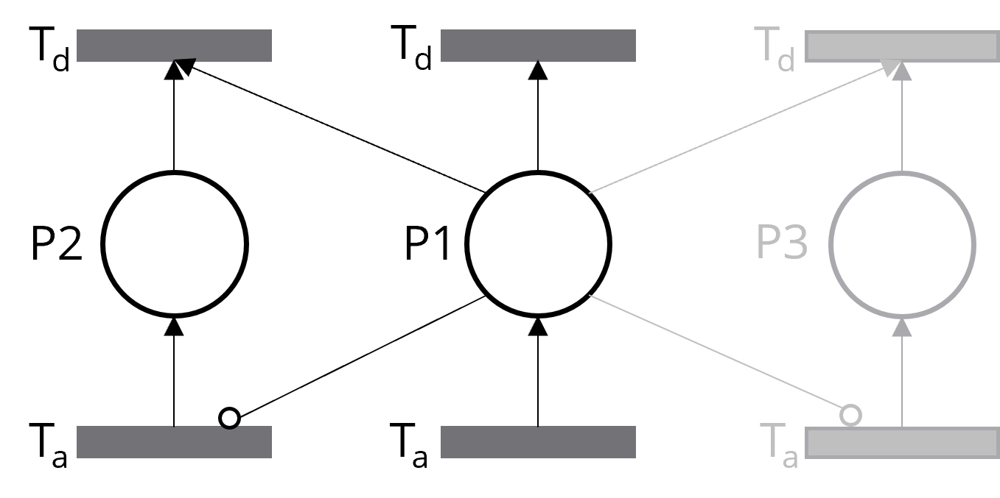

# CFPNlib

A powerful Modelica tool that facilitates **variability management** using **modular and context-driven control logic**, enabling scalable and adaptable system designs.

## I. Introduction

In adaptive systems, components often respond dynamically to changing contexts—whether these contexts are time-based (e.g., day and night cycles) or resource-driven (e.g., fluctuating energy availability). However, most modeling languages, including Modelica, lack support for **Context-oriented Programming (COP)**, a paradigm for modular, flexible, and adaptable system behavior. COP allows models to adapt to contexts dynamically. It simplifies context definition (e.g., `when DayMode.isActive then ...`), reducing the need for cumbersome `if/else` statements and complex `when` clauses, enabling efficient variability management.

The benefits of COP include:

1.  Separation of Concerns
    * COP separates core logic from context-specific adaptations, keeping components clean and focused.
2.  Modularity and Reusability
    * Components can be reused in different contexts without changes, making them flexible and adaptable.
3.  Easier Maintenance and Scalability
    * Context-specific logic is isolated, making systems easier to update and expand.
4.  Improved Readability and Understandability
    * Centralized context definitions make the code clearer and easier to understand.

However, most modeling languages don’t support COP natively. **CFPNlib fills this gap by bringing COP principles to Modelica**, enabling developers to build flexible, context-aware models with ease.

## II. Why CFPNlib? Why Not If/Else or When?

Well, in small models, embedding control logic with `if/else` and `when` statements might be straightforward. However, as the number of contexts grows, this approach becomes harder to maintain and expand. Especially, defining parent-child or mutually exclusive contexts can quickly lead to a tangled mess of redundant code. While you might still be able to make sense of it after some time, others will likely struggle to understand and work with the model.

**So, what if there was a simpler, cleaner, and more intuitive way to define contexts in natural language, while also supporting parent-child and mutually exclusive contexts that are easy to maintain and extend?**

**CFPNlib** provides a solution to this problem by:

- allowing modelers to define context-specific configurations separately from the core model, enabling dynamic control of system behavior (such as energy-saving or performance modes) without altering the underlying Modelica components. This keeps the model clean, modular, and easy to maintain.

In CFPNlib, the base component (illustrated below) encapsulates each context or feature as a "place" with activation and deactivation transitions. **CFPNlib abstracts the complexity of Petri Nets**, allowing modelers to **intuitively define contexts, activation conditions, parent-child relationships, and mutual exclusivity in an intuitive way**—no expertise in Petri Nets required. This results in a much simpler, more manageable design.


Below is a straightforward example of defining mutually exclusive features, **"brewing"** and **"grinding"**, with "brewing" given priority. This setup ensures that if "brewing" is active, "grinding" cannot be activated, and if "grinding" is already active, it will be deactivated if "brewing" becomes active.

```modelica
  // Define Grinding Feature as a non-priority exclusive element
  FeatureWithConditionEvent grinding(
    featureName = "Grinding",
    activationCondition = startGrindingButton and (not brewing.isActive)  // Grinding can only be activated if Brewing is not active
  ) "Grinding feature";
```

Below is an example of hierarchical contexts, "LowLoad" is defined as a child context of "NormalMode", meaning that "LowLoad" can only activate if "NormalMode" is already active. This parent-child relationship simplifies managing multiple layers of conditions.

```modelica
  // Nested Load Levels within Normal Mode
  ContextWithConditionEvent lowLoad(
    contextName = "LowLoad", 
    parentContext = "NormalMode", 
    activationCondition = (hydrogenLevel >= 20.0 and hydrogenLevel < 40.0)
  ) "Low load mode within NormalMode";
```

Key highlights of CFPNlib:

1. **Variability Management**: 
   * Manages system variability through **Contexts** (conditions) and **Features** (functionality), enabling different behaviors based on triggers.
2. **Exclusivity and Priority**: 
   * Supports **mutual exclusivity** and **priority** handling, ensuring high-priority contexts activate first, ideal for conflict resolution.
3. **Nested Contexts and Features**: 
   * Enables **hierarchical control** with nested contexts and features, offering fine-grained management for complex systems.
4. **Separation of Concerns**: 
   * Improves **modularity** and **readability**, simplifying the management and expansion of complex models with distinct functional areas.

## III. How CFPNlib Integrates with Modelica

CFPNlib serves as a **Control Layer** that manages system variability, leveraging modular **Petri Nets** to represent different contexts and manage state transitions. This layer dynamically configures Modelica models in the **System Layer** in response to environmental states or operational requirements. The diagram below illustrates this layered architecture, with CFPNlib providing adaptive control over the System Layer’s behavior.


## IV. For Petri Nets Experts

If you're familiar with Petri Nets, I've got some interesting insights for you.

### 1. How Does the Internal Logic Work?

In the base component, each context or feature is represented by a *place* with *activation* and *deactivation transitions*. The token count of the place is either 0 or 1—0 means the context is inactive, and 1 means it's active.

Here’s where it gets tricky. In Modelica, for a time-based context like `when t > 4`, the activation happens at `t = 4` and only triggers once. But for condition-based contexts like `when hydrogenLevel > 20`, activation keeps triggering as long as the condition holds. This constant triggering can hurt performance, and it also means the token count doesn’t toggle between 0 and 1—it just keeps increasing.

To solve this, I modified the Petri Net logic in the base component so the token count always stays 0 or 1. Whether it’s a time-based or condition-based trigger, the context is active when the token count is 1 and inactive when it’s 0. Simple and consistent!

### 2. How Do Parent-Child Contexts Work?

This is pretty straightforward. A child context checks if its parent context is active before activating. If the parent deactivates, the child deactivates automatically. This logic is built into the base component.

For example, take the *LowLoad* mode. It only activates when *NormalMode* is active, and `hydrogenLevel` is between 20 and 40.

```modelica
  // Nested Load Levels within Normal Mode
  ContextWithConditionEvent lowLoad(
    contextName = "LowLoad", 
    parentContext = "NormalMode", 
    activationCondition = (hydrogenLevel >= 20.0 and hydrogenLevel < 40.0)
  ) "Low load mode within NormalMode";
```

### 3. How Does Mutual Exclusivity Work?

This is also simple. You can define as many mutually exclusive contexts as you want, and you have full control over which ones get priority.

For instance, let’s say the `Brewing` feature has priority over `Grinding`. When `Brewing` is active, it prevents `Grinding` from activating. If `Grinding` is already active and you start `Brewing`, it deactivates `Grinding` automatically.

```modelica
  // Define Grinding Feature as a non-priority exclusive element
  FeatureWithConditionEvent grinding(
    featureName = "Grinding",
    activationCondition = startGrindingButton and (not brewing.isActive)  // Grinding can only be activated if Brewing is not active
  ) "Grinding feature";
```

### 4. Why Not Use Inhibitor Arcs?

Great question! I did consider inhibitor arcs but ran into two major issues.

1. **Dynamic Connections in Modelica**: To handle mutual exclusivity with inhibitor arcs, each component would need to dynamically create connections. For example, if `Context 1` and `Context 2` are mutually exclusive, and `Context 1` has priority, the place for `Context 1` would need to connect to the activation and deactivation transitions of `Context 2`. Now, imagine you have three, five, or even ten contexts, all with varying priorities and mutual exclusions—how could the base component dynamically adapt itself? Unfortunately, Modelica doesn’t support dynamically adding connectors like this, which makes scaling this approach impractical.



2. **Loss of Encapsulation**: If modelers had to manually connect these inhibitor arcs, the Petri Net mechanics wouldn’t stay hidden. That defeats the purpose of CFPNlib. My goal is to provide a modular, easy-to-use tool where modelers don’t need to understand the underlying Petri Net logic.

Instead, I came up with a more intuitive way to handle mutual exclusivity while keeping the flexibility. As shown in the `Grinding` and `Brewing` example, users can define priorities and exclusivity easily, without needing to dive into Petri Net details.

